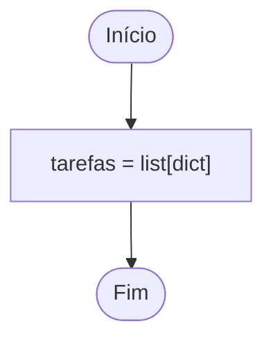
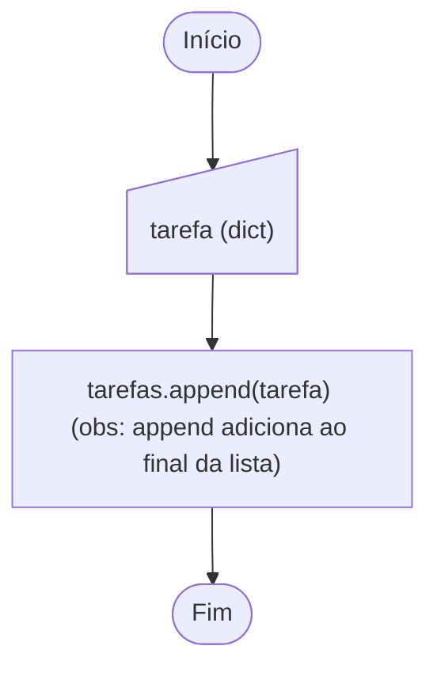
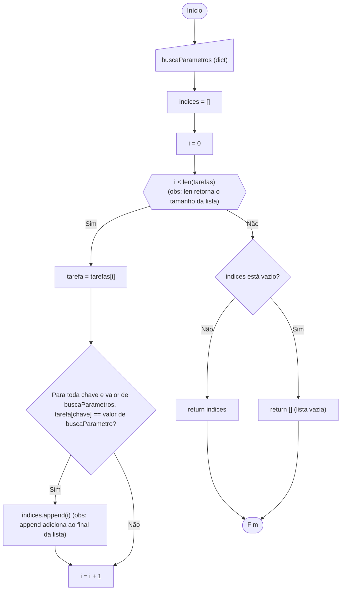
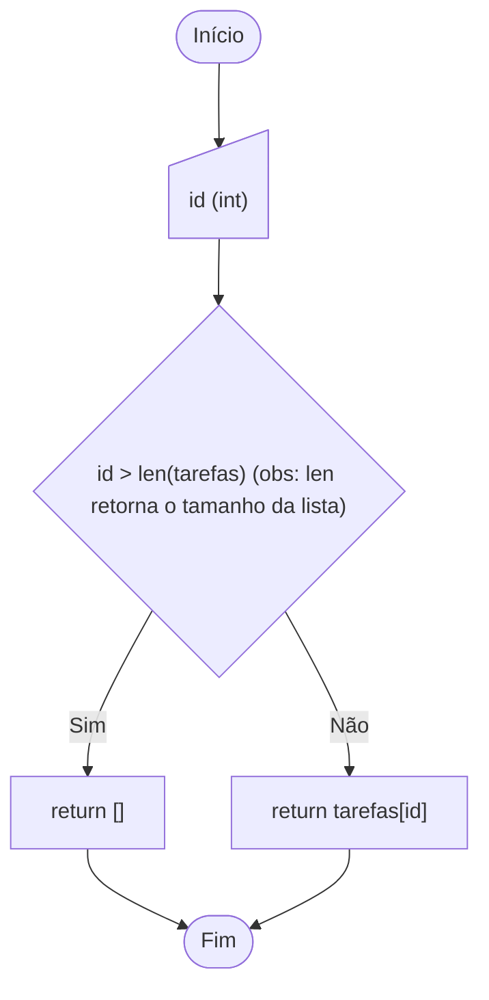
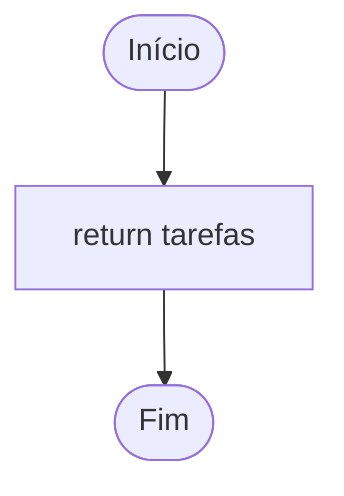
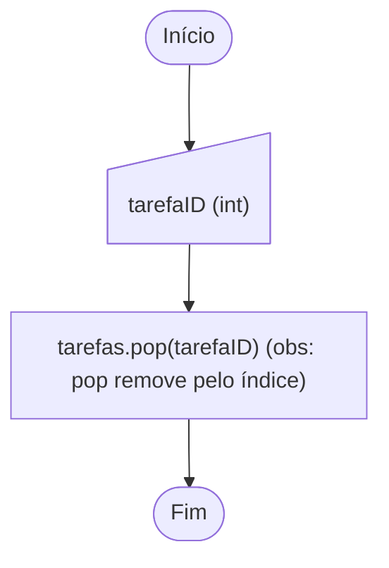
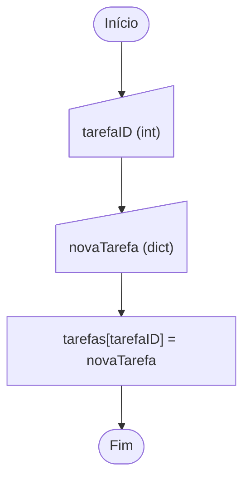

# Fluxogramas do programa

## Observação

Todos fluxogramas serão das funções encontradas no arquivo [crud.py](../crud.py).
O arquivo [app.py](../app.py) contém somente instruções de prints e inputs. Algumas de suas funções chamam as funções de `crud.py` para manipular as tarefas, mas essas funções não manipulam elas por si mesmas. São mais detalhes de controle do loop do programa e visualização das informações.

### Variável `tarefas`

- É uma lista de dicionários que contém cada informação das tarefas. Ela se econtra definida no topo do código.

### adicionarTarefa(tarefa: dict)

### buscarTarefa(buscaParametros: dict)

### buscarTarefaID(id: int)

### listarTarefas()

### deletarTarefaID(tarefaID: int)

### atualizarTarefa(tarefaID: int, novaTarefa: dict)

